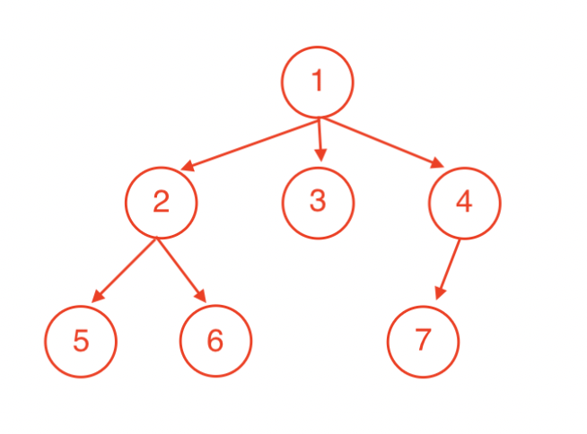
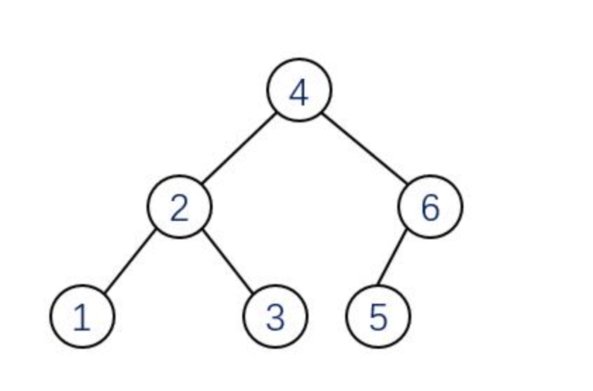
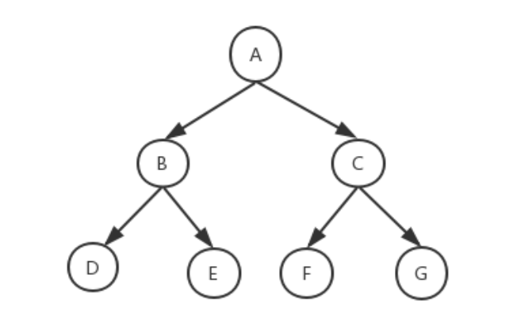
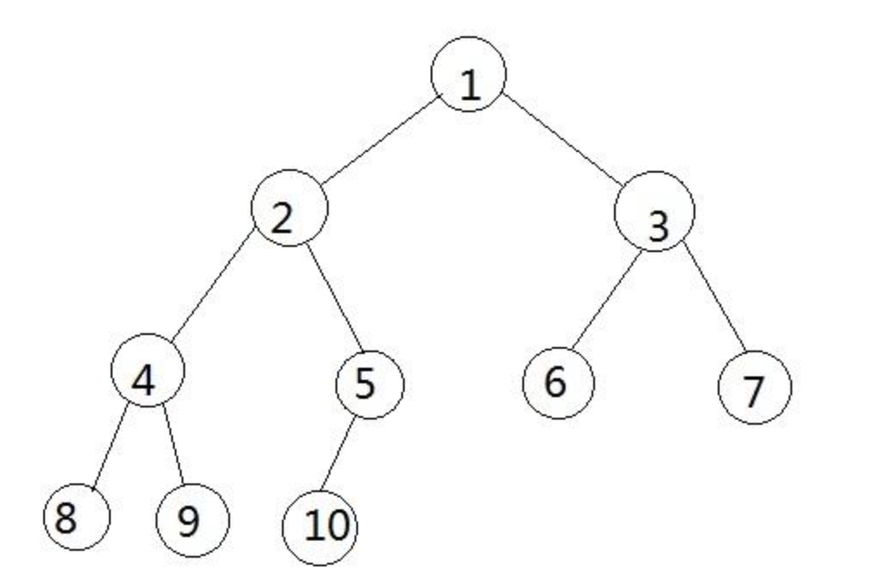
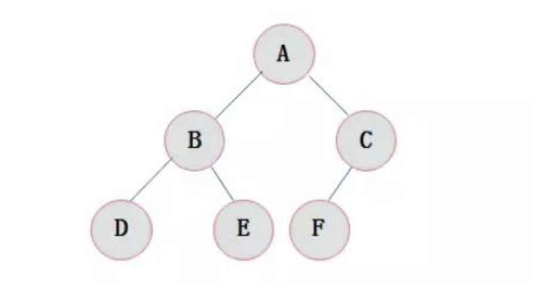
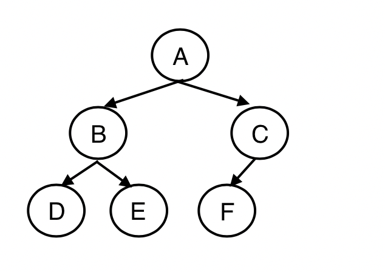
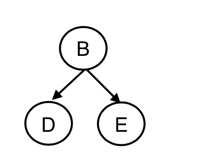
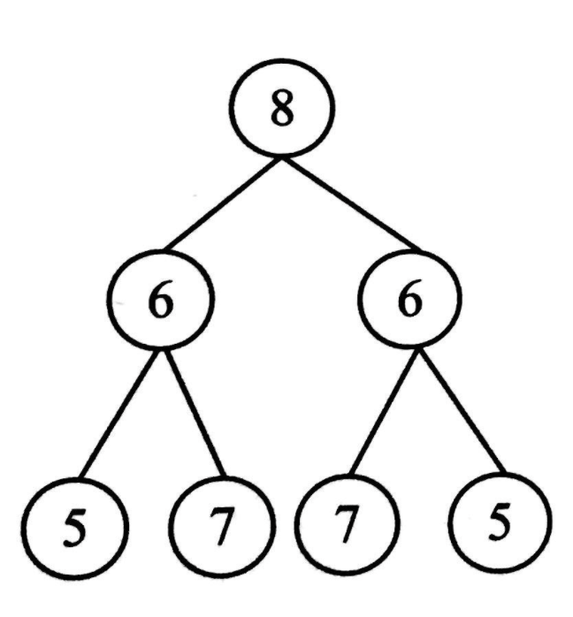

# 树
## 1、概念
树是一种数据结构，它是由n(n>=1)个有限节点组成一个具有层次关系的集合。把它叫做“树”是因为它看起来像一棵倒挂的树，也就是说它是根朝上，而叶朝下的。
;
#### 1.1 节点
每个元素称为节点（node），节点包含数据项，和指向其他节点的指针。
#### 1.2 节点的度
一个节点含有的子节点的个数称为该节点的度。上图示例中节点1的度是三，节点2的度是二，节点4的度是一，节点3、节点5、节点6、节点7的度是零。

#### 1.3 叶节点
度为0的节点被成为叶节点，如上图中的3、5、6、7

#### 1.4 分支节点
除了叶节点其的都是分支节点，如上图中1、3、4

#### 1.5 子节点
一个节点含有的子树的根节点称为该节点的子节点。也叫子女节点或者叫孩子节点

#### 1.6 父节点
若一个节点含有子节点，则这个节点称为其子节点的父节点

#### 1.7 兄弟节点
具有相同父节点的节点互称为兄弟节点

#### 1.8 堂兄弟节点
父节点在同一层的节点互为堂兄弟

#### 1.9 祖先节点
从根到该节点所经分支上的所有节点，都是该节点的祖先节点

#### 1.10 子孙节点
以某节点为根的子树中任一节点都称为该节点的子孙节点

#### 1.11 节点的层次
从根开始定义起，根为第1层，根的子节点为第2层，以此类推

#### 1.12 树的深度
对于任意节点n,n的深度为从根到n的唯一路径长，根的深度为0

#### 1.13 树的高度
对于任意节点n,n的高度为从n到一片树叶的最长路径长，所有树叶的高度为0

#### 1.14 树的度
一棵树中，最大的节点度称为树的度

#### 1.15 树的边
树的边等于总节点数减一，也等于每个节点的度之和。

#### 1.16 森林
由m（m>=0）棵互不相交的树的集合称为森林


## 2、二叉树
### 2.1 概念
每个节点最多含有两个子树的树称为二叉树。
二叉树是最常用的树形结构，也是重点研究对象。


### 2.2 二叉树的特点
* 在二叉树的第i(i>=1)层，最多有2i-1 个节点。
* 深度为k(k>=0)的二叉树，最少有k个节点，最多有2^k -1 个节点。
* 对于一棵非空二叉树，叶节点的数量等于度为2的节点数量加1。

>叶节点的数量与度为2的节点数量关系证明：
再引入“边”的概念
观察上图中的树，设总结点数为N，叶节点（度为0）的数量为N0，度为1的节点数量为N1，度为2的节点数量为N2，则有以下公式：
N = N0 + N1 + N2;（公式1）
根据树的边的定义设树的边B，则有
B = N - 1;（公式2）
B = 0\*N0 + 1\*N1 + 2\*N2 = N1 + 2\*N2; （公式3）
把公式1代入公式2：
B = N0 + N1 + N2 - 1; （公式4）
把公式4代入公式3：
N0 + N1 + N2 - 1 = N1 + 2\*N2;
N0 = N2 + 1;

### 2.3 特殊二叉树
#### 2.3.1 满二叉树
深度为k的满二叉树，有2k-1 个节点，每一层都达到了可以容纳的最大数量的节点


#### 2.3.2 完全二叉树
一棵深度为k的有n个结点的二叉树，对树中的结点按从上至下、从左到右的顺序进行编号，如果编号为i（1≤i≤n）的结点与满二叉树中编号为i的结点在二叉树中的位置相同，则这棵二叉树称为完全二叉树。

**性质：**

* 具有n个结点的完全二叉树的深度（注：[ ]表示向下取整）
* 如果对一棵有n个结点的完全二叉树的结点按层序编号, 则对任一结点i (1≤i≤n) 有:
  * 如果i=1, 则结点i是二叉树的根, 无双亲;如果i>1, 则其双亲parent (i) 是结点[i/2].
  * 如果2i>n, 则结点i无左孩子, 否则其左孩子lchild (i) 是结点2i;
  * 如果2i+1>n, 则结点i无右孩子, 否则其右孩子rchild (i) 是结点2i+1

**特点：**

完全二叉树的特点：叶子结点只能出现在最下层和次下层，且最下层的叶子结点集中在树的左部。需要注意的是，满二叉树肯定是完全二叉树，而完全二叉树不一定是满二叉树。


**判断条件**
1. 如果树为空，直接返回false
2. 如果不为空，层序遍历树
3. 如果一个结点左右孩子都不为空，则pop该节点，将其左右孩子入队列
4. 如果遇到一个结点，左孩子为空，右孩子不为空，则该树一定不是完全二叉树，返回false
5. 如果遇到一个结点，左孩子不为空，右孩子为空；或者左右孩子都为空；则该节点之后的队列中的结点都为叶子节点；该树才是完全二叉树，否则就不是完全二叉树


### 2.4 定义二叉树
#### 2.4.1 节点
```
function TreeNode(data) {
  this.data = data;
  this.leftChild = null;    // 左孩子
  this.rightChild = null;   // 右孩子
  this.parentNode = null;   // 父节点
}
```
#### 2.4.2 树类
根据[广义表](https://baike.baidu.com/item/%E5%B9%BF%E4%B9%89%E8%A1%A8/3685109?fr=aladdin)来创建树，比如A(B(D,E),C(F))#代表如下树结构：

**算法：**
联想到如何用栈校验括号的合法性，借助该算法，可以利用栈帮助创建树。
1. 遍历广义表字符串，遇到字母则创建节点
2. 遇到左括号，说明之前存在一个节点，把该节点入栈，而且括号里面的节点是它的子节点，但是需要区分是左子节点还是右子节点，需要根据第三步逗号出现的时机判断左右
3. 在遇到逗号出现之前被认为是左子节点，在遇到逗号之后是右子节点
4. 遇到右括号说明该子树结束了，而且栈顶就是该子树的根节点，执行pop方法出栈。

```
function Tree() {
  var root = null;   // 根节点
  this.getRoot = function() {
    return root;
  }
  this.initTree = function(string) {
    let stack = new Stack();
    let new_node = null;  // 记录每次遇到字母创建的节点
    let k = 0;  // k初始值设为0，k=1代表左子节点，k=2代表右子节点
    for(let i = 0; i < string.length; i++) {
      let item = string[i];
      if(item == '(') {
        stock.push(new_node);
        k = 1;
      }
      else if(item == ',') {
        k = 2;
      } else if(item == ')') {
        stock.pop();
      } else {
        // 遇到字母
        new_node = new TreeNode(item);
        if(!root) {
          // 如果跟节点不存在 说明是第一个字母
          root = new_node;
        }
        if(k == 1) {
          // 左子节点
          father = stock.top(); // 栈顶一定是该子节点的父节点
          father.leftChild = new_node;
          new_node.parentNode = father;
        } 
        else if (k == 2) {
          // 右子节点
          father = stock.top(); // 栈顶一定是该子节点的父节点
          father.rightChild = new_node;
          new_node.parentNode = father;
        }
      }
    }
  }
}
```

### 2.5 方法扩展
树的遍历包括前序遍历(父节点->左子节点->右子节点)、中序遍历(左子节点->父节点->右子节点)、后序遍历(左子节点->右子节点->父节点)和层序遍历(逐层遍历)。
#### 2.5.1 前序遍历
对树的遍历非常适合使用递归，因为每一个子树都是一个完整的树结构。
前序遍历：父节点->左子节点->右子节点
```
this.pre_order = function(node){
    if(node==null){
        return;
    }
    console.log(node.data);
    this.pre_order(node.leftChild);
    this.pre_order(node.rightChild);
};
```

#### 2.5.2 中序遍历
中序遍历：左子节点->父节点->右子节点
```
this.in_order = function(node){
    if(node==null){
        return;
    }
    this.in_order(node.leftChild);
    console.log(node.data);
    this.in_order(node.rightChild);
};
```

#### 2.5.3 后序遍历
```
this.post_order = function(node){
    if(node==null){
        return;
    }
    this.post_order(node.leftChild);
    this.post_order(node.rightChild);
    console.log(node.data);
};
```

#### 2.5.4 层序遍历
层序遍历可以借助队列
1. 把根节点添加到队列
2. 判断是否有子节点，如果有把子节点添加到队列末尾
3. 遍历过的节点出队列
4. 直到队列为空

```
this.layer_order = function(node) {
    if(!node) return;
    let queue = new Queue();
    queue.enqueue(node);
    while(!queue.isEmpty()) {
      let curNode = queue.dequeue();
      console.log(curNode.data);
      if(curNode.leftChild) {
        queue.enqueue(curNode.leftChild);
      }
      if(curNode.rightChild) {
        queue.enqueue(curNode.rightChild);
      }
    }
  }
```

#### 2.5.5 逐层打印树
```
this.layer_print = function(node) {
  if(!node) return;
  let queue = new Queue();
  queue.enqueue(node);
  while(!queue.isEmpty()) {
    let size = queue.size();
    let arr = [];
    for(let i = 0; i < size; i++) {
      let curNode = queue.dequeue();
      if(curNode.leftChild) {
        queue.enqueue(curNode.leftChild)
      }
      if(curNode.rightChild) {
        queue.enqueue(curNode.rightChild)
      }
      arr.push(curNode.data)
    }
    console.log(arr.join(' '))
  }
}
```

#### 2.5.6 size
size方法返回树的节点数量
```
function node_count(node) {
  if(!node) {
    return 0;
  }
  let leftChildCount = node_count(node.leftChild);
  let rightChildCount = node_count(node.rightChild);
  return leftChildCount + rightChildCount + 1;
}
this.size = function() {
  return node_count(root);
}
```

### 2.6 习题
#### 2.6.1 树的镜像
对于一棵树，如果每个节点的左右子树互换位置，那么就变成了这棵树的镜像
递归思路：
1. 定义递归函数的功能：反转某个节点的左右子节点，并返回当前节点
2. 甩锅：对于每个节点来说都需要把左右节点互换，每个节点的子节点可能还有子节点，每个节点都希望其左右子树是已经互换完成的子树，只需要把其子节点互换就可以了，直接甩锅给子节点去翻转
3. 终止条件：直到叶节点，叶节点没有子节点，不用翻转，直接返回
```
function mirror(node) {
  // 叶节点 直接返回
  if(!node) return; 

  // 甩锅给子节点进行翻转
  let leftChild = mirror(node.leftChild);
  let rightChild = mirror(node.rightChild);

  // 进行翻转
  node.leftChild = rightChild;
  node.rightChild = leftChild;

  // 返回当前节点
  return node;
}
```

#### 2.6.2 判断子树
给定两个树A,B
<figure class="third">

</figure>

判断树B是否是树A的子树。
算法：
判断B是A的子树的唯一方法就是在A树存在一个节点等于B树的根节点，并且他们的子节点孙节点都是一样的。
1. 遍历A树，找到一个节点与B树的根节点相等，如果找不到则返回false
2. 如果在树A中找到节点与B树根节点相等，递归判断他们的左子节点和右子节点是否相等，如果他们的子节点不相等则返回false，如果A树遍历结束，而B树还没有遍历结束（B树的某个节点还有子节点，而A树已经往下找不到子节点了），则返回false
3. 终止条件：根据上面的查询条件，只要A树遍历的当前节点与B树遍历的当前节点相等，并且他们的子节点也相等，就会一直查找下去，最终的结果是B树遍历结束，这时候返回true。

```
function sub(rootA, rootB) {
  if(rootA.data == rootB.data) {
    return rec(rootA, rootB);
  }
  let leftResult = sub(rootA.leftChild, rootB);
  let rightResult = sub(rootA.rightChild, rootB);
  return leftResult || rightResult;
}
rec(nodeA, nodeB) {
  if(!nodeA) {
    return false；
  }
  if(nodeA.data != nodeB.data) {
    return false;
  }
  if(!nodeB) {
    return true;
  }
  let leftResult = rec(nodeA.leftChild, nodeB.leftChild);
  let rightResult = rec(nodeA.rightChild, nodeB.rightChild);
  return leftResult && rightResult;
}
```

#### 2.6.3 判断树对称
如果一棵二叉树和它的镜像一样，则这个树是对称的。如图：
<figure>
</img>
</figure>

思路：
判断一个树是二叉树，需要判断对称位置的两个节点（L,R）是否相等，且
L.leftChild与R.rightChild相等L.rightChild与R.leftChild相等。
```
// 判断对称树
function isSymmetric(root) {
  if(!root) return true;
  return symmetric(root.leftChild, root.rightChild);
}
function symmetric(node_1, node_2) {
  if (node_1 && node_2 && node_1.data != node_2.data) {
    return false;
  }
  if(node_1 && !node_2) {
    return false;
  }
  if(!node_1 && node_2) {
    return false;
  }
  if(!node_1 && !node_2) {
    return true;
  }

  let leftResult = symmetric(node_1.leftChild, node_2.rightChild);
  let rightResult = symmetric(node_1.rightChild, node_2.leftChild);
  return leftResult && rightResult;
}
```

#### 2.6.4 迭代实现前序遍历
思路：
不使用递归，需要用到while循环从根节点开始遍历
1. 设当前节点cur_node，先处理（打印）当前节点
2. 如果当前节点存在左右子节点，先把右子节点暂存起来，当前节点cur_node=cur_node.leftChild，继续往下处理，
3. 直到cur_node没有左子节点，回过头来按照暂存右子节点的逆序处理，cur_node=最后一个暂存的右子节点，继续执行步骤2
4. 最后没有暂存需要处理的右子节点，遍历结束

根据上述思路，正好可以用栈来暂存右子节点
```
function pre_order_iter(node) {
  let stack = new Stack();
  let cur_node = node;
  while(cur_node) {
    console.log(cur_node.data);
    if(cur_node.rightChild) {
      stack.push(cur_node.rightChild);
    }
    if(cur_node.leftChild) {
      cur_node = cur_node.leftChild;
    } else {
      if(!stack.isEmpty()) {
        cur_node = stack.pop();
      } else {
        cur_node = null;
      }
    }
  }
}
```

#### 2.6.5 迭代实现中序遍历
**思路1：**
从根结点开始，遍历左孩子同时压栈，当遍历结束，说明当前遍历的结点没有左孩子，从栈中取出来调用操作函数，然后访问该结点的右孩子，继续以上重复性的操作。
```
// 实现方式一
function in_order_iter1(node) {
  const stack = new Stack();
  let cur_node = node;
  while(true) {
    while(cur_node) {
      stack.push(cur_node);
      cur_node = cur_node.leftChild;
    }
    
    cur_node = stack.pop();
    console.log(cur_node.data);
    cur_node = cur_node.rightChild;
    if(stack.isEmpty() && !cur_node) {
      break;
    }
  }
}
// 实现方式二
function in_order_iter2(node) {
  const stack = new Stack();
  let cur_node = node;
  stack.push(cur_node);
  let t = stack.top();
  let size = stack.size();
  while(!stack.isEmpty()) {
    while(stack.top() && cur_node) {
      stack.push(cur_node.leftChild);
      cur_node = cur_node.leftChild;
    }
    let pop = stack.pop();
    if(!stack.isEmpty()) {
      cur_node = stack.pop();
      console.log(cur_node.data);
      stack.push(cur_node.rightChild);
      cur_node = cur_node.rightChild;
    }
  }
}
```
**思路二**
中序遍历过程中，只需将每个结点的左子树压栈即可，右子树不需要压栈。当结点的左子树遍历完成后，只需要以栈顶结点的右孩子为根结点，继续循环遍历即可。
```
function in_order_iter(node) {
  const stack = new Stack();
  let cur_node = node;
  while(cur_node || !stack.isEmpty()) {
    let size = stack.size();
    let top = stack.top();
    if(cur_node) {
      stack.push(cur_node);
      cur_node = cur_node.leftChild;
    } else {
      cur_node = stack.pop();
      console.log(cur_node.data);
      cur_node = cur_node.rightChild;
    }
  }
}
```

#### 2.6.6 迭代实现后序遍历
**思路：**
后序遍历是在遍历完当前结点的左右孩子之后，才调用操作函数，所以需要在操作结点进栈时，为每个结点配备一个标志位。当遍历该结点的左孩子时，设置当前结点的标志位为 0，进栈；当要遍历该结点的右孩子时，设置当前结点的标志位为 1，进栈。
当遍历完成，该结点弹栈时，查看该结点的标志位的值：如果是 0，表示该结点的右孩子还没有遍历；反之如果是 1，说明该结点的左右孩子都遍历完成，可以调用操作函数。


```
var Tag = function(node, state){
  this.node = node;
  this.state = state;    // 0表示左边已经遍历结束,1表示右边已经遍历结束
};
function post_order_iter(node){
  var stack = new Stack();
  var curr_node = node;
  while(true){
      while(curr_node){
          var tag = new Tag(curr_node, 0);
          stack.push(tag);
          curr_node = curr_node.leftChild;
      }

      var pop_item = stack.pop();
      if(pop_item.node.rightChild && pop_item.state==0){
          pop_item.state = 1;
          stack.push(pop_item);
          curr_node = pop_item.node.rightChild;
      }else{
          console.log(pop_item.node.data);
      }
      if(!curr_node && stack.isEmpty()){
          break;
      }
  }
};
```

#### 2.6.7 查找两个节点的最近公共祖先
给定如下树，找出节点9和节点5最近的公共父节点
<figure class="third">

</figure>


**思路：**
不考虑节点找不到的情况，从根节点开始遍历，目标节点要么都分布在其左子树要么都分布在其右子树，要么分别分布在其左右子树。如果分别分布
根据上述思路，在遍历时，对于当前节点只想知道以左右子节点给根节点的子树是否存在目标节点，如果左右子树分别存在目标节点，当前节点就是最近的公共父节点，如果其右子树不存在目标节点，那么两个目标都在左子树中，继续以左子节点为根节继续查询，反之以右子节点为根节点查询。

递归设计：

1. 递归函数的作用：查找左右子树是否存在目标节点，判断目标节点在左右子树的分布情况
2. 终止条件：如果当前节点不存在，返回null，如果当前节点存在，判断是否与目标节点其中一个相等，如果相等则返回当前节点

```
function lowest_common_ancestor(node, target1, target2) {
  if(!node) {
    return null;
  }
  if(node.data == target1.data || node.data == target2.data) {
    return node;
  }
  let leftResult = lowest_common_ancestor(node.leftChild, target1, target2);
  let rightResult = lowest_common_ancestor(node.rightChild, target1, target2);
  if(leftResult && rightResult) {
    console.log(node.data)
    return;
  }
  if(leftResult) {
    return leftResult
  }
  if(rightResult) {
    return rightResult
  }
}
```


