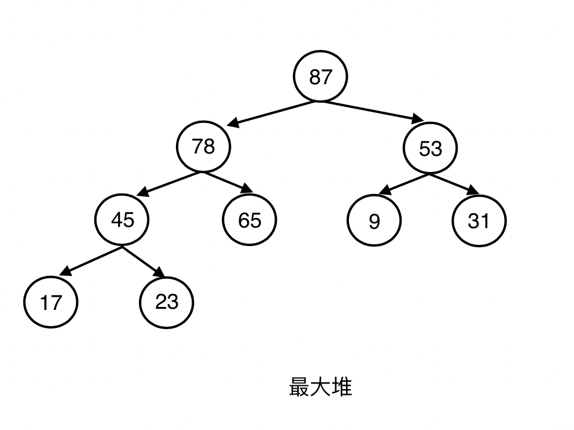
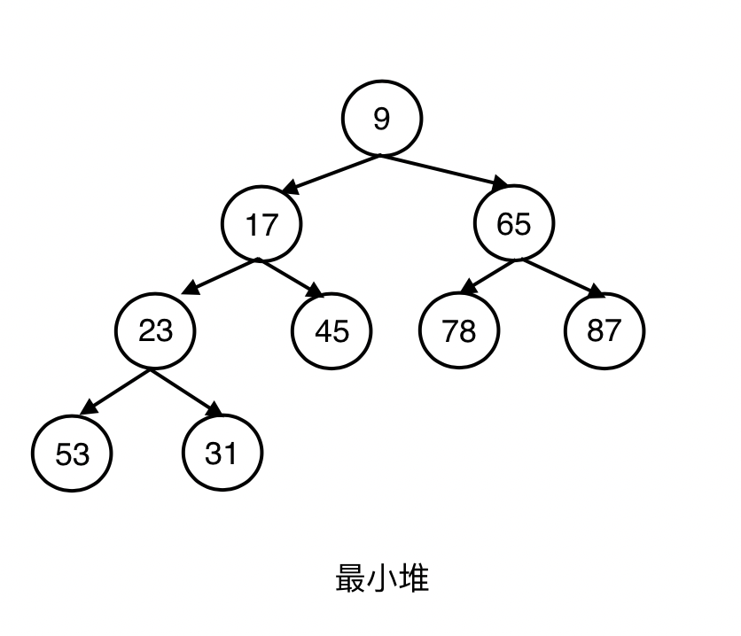
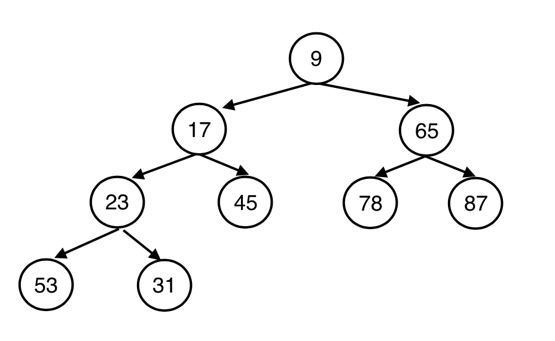
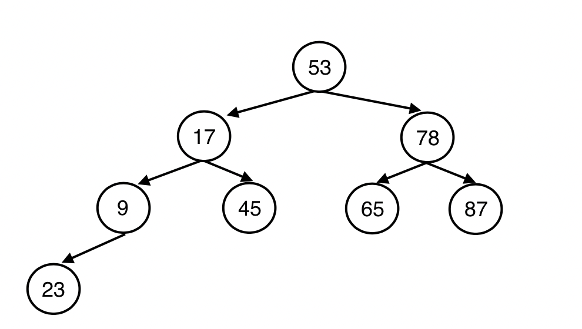
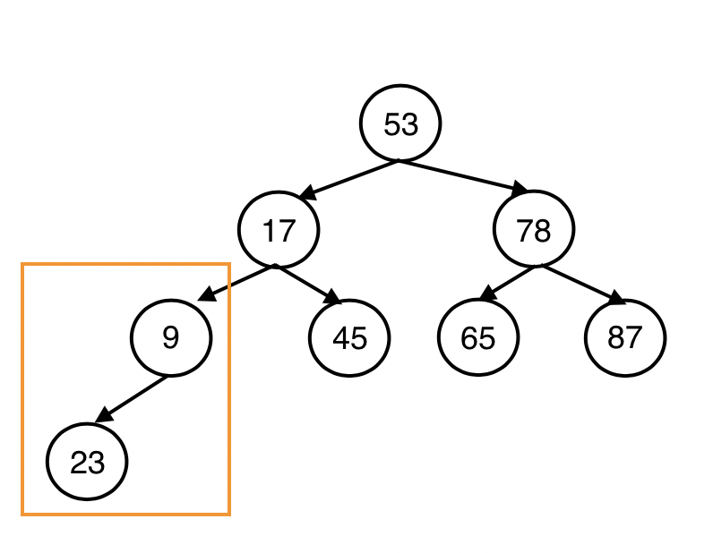
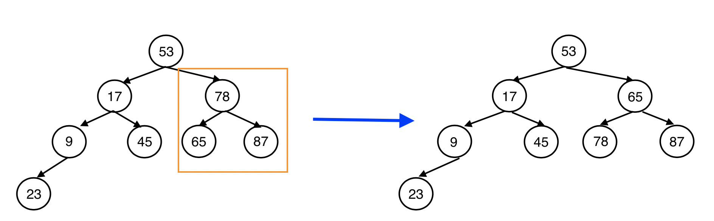
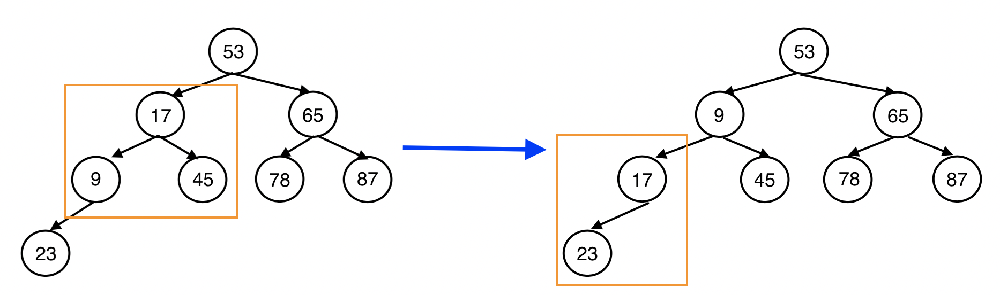
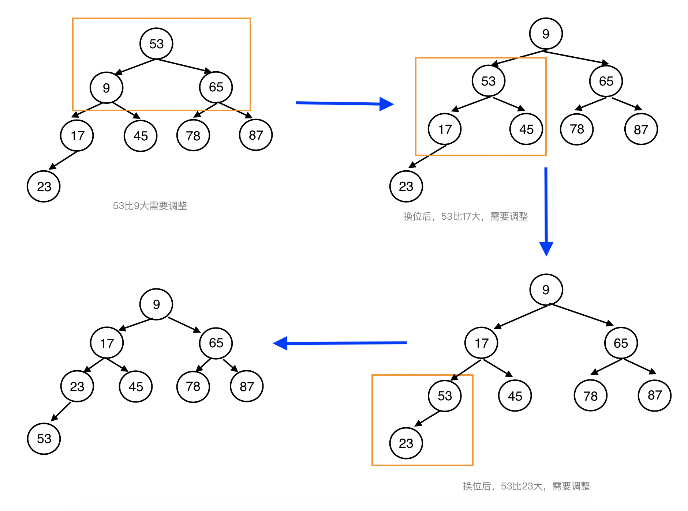
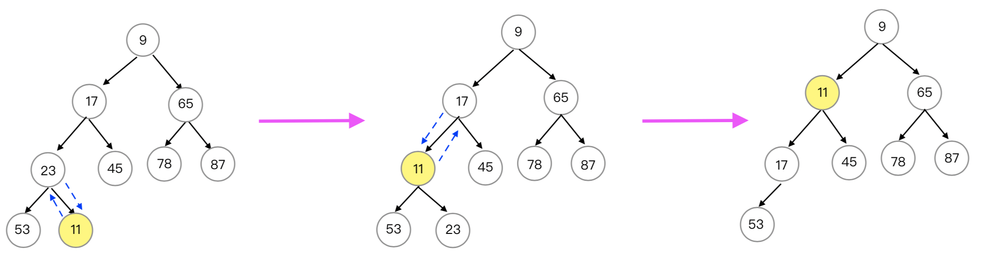

# 堆
## 1、概念
### 1.1 定义
堆(Heap)是计算机科学中一类特殊的数据结构的统称。堆通常是一个可以被看做一棵完全二叉树的数组对象。堆总是满足下列性质：
* 堆中某个结点的值总是不大于或不小于其父结点的值
* 堆总是一棵完全二叉树

将根结点最大的堆叫做最大堆或大根堆，根结点最小的堆叫做最小堆或小根堆。

**还有一种定义堆的概念：**

假定在数据记录中存在一个能够标识数据记录的数据项，并可依据该数据项对数据进行组织，则称此数据项为关键码（key）

如果有一个关键码集合K = {k0 , k1 , k2 , k3 , ... kn-1 } ，把它的所有元素按照完全二叉树的顺序存储方式存放在一个一维数组中，并且满足ki ≤ k2i+1 且 ki ≤ k2i+2 （或者 ki ≥ k2i+1 且 ki ≥ k2i+2） ,i = 0, 1,2, ... (n-2)/2,则称这个集合为最小堆(最大堆)。

在最小堆中，父节点的关键码小于等于它的左右子女的关键码，最大堆中，父节点的关键码大于等于左右子女的关键码。
### 1.2 应用场景
比如优先级队列，优先级队列并不满足先进先出的特性，它能做到高优先级的先出队列，在优先级队列的各种实现中，堆是最高效的一种数据结构。
还比如有大量数据（10亿条），大到无法使用一次性取出所有数据在内存中进行排序，要想找出里面最大的前10条数据（topN问题）用堆是最好的实现

### 1.3 数组存储
假设存在数组min_heap_arr
```
min_heap_arr = [9, 17, 65, 23, 45, 78, 87, 53, 31]
```
其对应的最大堆和最小堆：
<figure class="third">

</figure>


## 2、完全二叉树
### 2.1 数组存储
数组min_heap_arr = [9, 17, 65, 23, 45, 78, 87, 53, 31]对应的完全二叉树：


### 2.2 特性
#### 2.2.1 特性一
如果节点在数组中的索引为i，在它的左孩子索引为2*i+1，右孩子索引为2*i+2
#### 2.2.2 特性二
最后一个非叶子节点（分支节点）的索引是(n-2)/2的向下取整，其中n是数组的长度，如上图中最后一个分支节点23的索引为Math.floor((9-2)/2)=3;
#### 2.2.3 特性三
最后一个分支节点索引之后的所有的数据对应的节点都是叶节点，之前（包括自己）的都是分支节点。
**证明：**
观察完全二叉树，根据完全二叉树的特点，最后一个分支节点的子节点一定存在数组的末尾。
最后一个分支节点分两种情况：

**情况①：只有左孩子节点，没有右孩子节点**
其左子节点的索引为n-1，假设最后一个分支节点的索引为i，根据特性一其左子节点索引为2*i+1，由n-1=2*i+1;得出i=(n-2)/2
**情况②：既有左孩子节点，也有右孩子节点**
其左子节点的索引为n-2，右子节点的索引为n-1，假设最后一个分支节点的索引为i，根据特性一其左子节点索引为2*i+1，由n-2=2*i+1，得出i=(n-3)/2；
右子节点索引为2*i+2；由n-1=2*i+2，得出i=(n-3)/2。

(n-3)/2与(n-2)/2向下取整之后的值是相等的，所以最后一个非叶子节点（分支节点）的索引是(n-2)/2的向下取整。

## 3、 最小堆实现
### 3.1 定义类
```
function MinHeap(size){
    var heap = new Array(size);    // 数组
    var curr_size = 0;             // 当前堆的大小
    var max_size = size;           // 堆最大容量
};
```

### 3.2 用数组初始化
数组[53, 17, 78, 9, 45, 65, 87, 23]用完全二叉树表示：

这只是一个普通的完全二叉树，不是最小堆，需要将其调整为最小堆，调整的过程自下而上，先保证局部是一个最小堆，然后从局部到整体，逐步扩大，直到将整棵树都调整为最小堆。

调整思路是找到所有的分支节点，从最后一个分支节点比较其孩子节点进行调整，使得这个节点与其子节点构成一个最小堆，然后依次往前调整，直到根节点。
最后一个分支节点9对应的索引为3，第一个分支节点（根节点）索引为0，从节点9开始调整

**流程图：**
第一步调整分支节点9，9比23小不需要调整

第二步调整分支节点78，其右子节点的值最小，令其与右子节点互换值

第三步调整分支节点17，其右子节点的值最小，令其与右子节点互换值，换位之后17比23小，不需要调整

第四步调整分支节点53，其右子节点的值最小，令其与右子节点互换值

结束。

**实现代码：**

```
function MinHeap(size){
  var heap = new Array(size);    // 数组
  var curr_size = 0;             // 当前堆的大小
  var max_size = size;           // 堆最大容量
  
  // 从给定的分支节点开始往下调整
  var shif_down = function(start){
    let m = curr_size - 1;
    // 从start这个位置开始,向下下滑调整
    var parent_index = start;                       // start就是当前这个局部的父节点
    var min_child_index = parent_index*2 + 1;       // 一定有左孩子,先让min_child_index等于左孩子的索引

    while(min_child_index <= m){
      // min_child_index+1 是左孩子的索引, 左孩子大于右孩子
      if(min_child_index < m && heap[min_child_index] > heap[min_child_index+1]){
        min_child_index = min_child_index+1;  // min_child_index永远指向值小的那个孩子
      }

      // 父节点的值小于等于两个孩子的最小值
      if(heap[parent_index] <= heap[min_child_index]){
        break;   // 循环结束,不需要再调整了
      }else{
        // 父节点和子节点的值互换
        var tmp = heap[parent_index];
        heap[parent_index] = heap[min_child_index];
        heap[min_child_index] = tmp;
        parent_index = min_child_index;
        min_child_index = 2*min_child_index + 1;
      }
    }

  };

  this.init = function(arr) {
    max_size = arr.length;
    curr_size = max_size;
    heap = new Array(arr.length);
    // 填充heap, 目前还不是一个堆
    for(var i =0; i<curr_size;i++){
        heap[i] = arr[i];
    }
    let curr_pos = Math.floor((max_size-2)/2);

    while(curr_pos >= 0) {
      shif_down(curr_pos);
      curr_pos--;
    }
  }

  this.print = function() {
    console.log(heap);
  }
};

const array = [53, 17, 78, 9, 45, 65, 87, 23];
const minHeap = new MinHeap(array.length);
minHeap.init(array);
minHeap.print();    // 打印：[9, 17, 65, 23, 45, 78, 87, 53]
```

### 3.3 insert方法
insert方法，最新的节点必然放到数组的最后一位，将新的元素插入到最小堆中，由于此前，最小堆已经建好，那么就可以从下向上，与父节点的关键码进行比较对调。

流程图（以插入11为例）：



**实现代码：**
```
function shif_up(index) {
  let curr_index = index;
  while(curr_index > 0) {
    // 父节点索引n，子节点索引i，则n=(i-1)/2的向下取整
    let parent_index = Math.floor((curr_index-1)/2);

    // 如果当前节点比父节点小 互换
    if(heap[curr_index] < heap[parent_index]) {
      let temp = heap[curr_index];
      heap[curr_index] = heap[parent_index];
      heap[parent_index] = temp;
      curr_index = parent_index;
    } else {
      break;
    }
  }
}
this.insert = function(data) {
  // 如果堆满了 不能再插入元素
  if(curr_size >= max_size) {
    return false;
  }
  // 数组末尾插入元素
  heap[curr_size] = data;
  shif_up(curr_size);
  curr_size++;
}
```

### 3.4 remove_min方法
删除掉最小堆的最小值，用最后一个元素取代堆顶元素，取代后，最小堆被破坏，使用shif_down方法向下做调整。
```
this.remove_min = function() {
  const min_data = heap[0];
  curr_size -= 1;
  heap[0] = heap[curr_size];
  heap[curr_size] = null;
  shif_down(0);
}
```

**完整代码：**
```
function MinHeap(size){
  var heap = new Array(size);    // 数组
  var curr_size = 0;             // 当前堆的大小
  var max_size = size;           // 堆最大容量
  
  // 从给定的分支节点开始往下调整
  var shif_down = function(start){
    let m = curr_size - 1;
    // 从start这个位置开始,向下下滑调整
    var parent_index = start;                       // start就是当前这个局部的父节点
    var min_child_index = parent_index*2 + 1;       // 一定有左孩子,先让min_child_index等于左孩子的索引

    while(min_child_index <= m){
      // min_child_index+1 是左孩子的索引, 左孩子大于右孩子
      if(min_child_index < m && heap[min_child_index] > heap[min_child_index+1]){
        min_child_index = min_child_index+1;  // min_child_index永远指向值小的那个孩子
      }

      // 父节点的值小于等于两个孩子的最小值
      if(heap[parent_index] <= heap[min_child_index]){
        break;   // 循环结束,不需要再调整了
      }else{
        // 父节点和子节点的值互换
        var tmp = heap[parent_index];
        heap[parent_index] = heap[min_child_index];
        heap[min_child_index] = tmp;
        parent_index = min_child_index;
        min_child_index = 2*min_child_index + 1;
      }
    }

  };

  this.init = function(arr) {
    max_size = arr.length;
    curr_size = max_size;
    heap = new Array(arr.length);
    // 填充heap, 目前还不是一个堆
    for(var i =0; i<curr_size;i++){
        heap[i] = arr[i];
    }
    let curr_pos = Math.floor((max_size-2)/2);

    while(curr_pos >= 0) {
      shif_down(curr_pos);
      curr_pos--;
    }
  }

  function shif_up(index) {
    let curr_index = index;
    while(curr_index > 0) {
      // 父节点索引n，子节点索引i，则n=(i-1)/2的向下取整
      let parent_index = Math.floor((curr_index-1)/2);
  
      // 如果当前节点比父节点小 互换
      if(heap[curr_index] < heap[parent_index]) {
        let temp = heap[curr_index];
        heap[curr_index] = heap[parent_index];
        heap[parent_index] = temp;
        curr_index = parent_index;
      } else {
        break;
      }
    }
  }
  this.insert = function(data) {
    // 如果堆满了 不能再插入元素
    if(curr_size >= max_size) {
      return false;
    }
    // 数组末尾插入元素
    heap[curr_size] = data;
    shif_up(curr_size)
    curr_size += 1;
  }

  this.remove_min = function() {
    const min_data = heap[0];
    curr_size -= 1;
    heap[0] = heap[curr_size];
    heap[curr_size] = null;
    shif_down(0);
    return min_data;
  }
  this.size = function(){
    return curr_size;
  };

  this.print = function(){
    console.log(heap);
  };

  this.get_min = function(){
    if(curr_size > 0){
        return heap[0];
    }
    return null;
  }
  this.print = function() {
    console.log(heap);
  }
};

```

## 4、使用场景
### 3.1 排序
可以使用最小堆进行排序，使用待排序数组初始化最小堆，然后逐个删除堆顶元素，由于堆顶元素始终最小，所以可以得到一个有序的数组

```
var arr = [53, 17, 78, 9, 45, 65, 87, 23];
var min_heap = new MinHeap(arr.length);
min_heap.init(arr)


var sort_arr = []
for(var i =0;i<arr.length;i++){
    sort_arr.push(min_heap.remove_min());
}

console.log(sort_arr);
```

### 3.2 Top K问题
一个非常大的数据集合有n个整数，求集合中最大的K个值。
用最小堆来算，非常简单，初始化一个大小为k的最小堆，先放入k个数，这时，堆顶元素最小，集合中剩余的数依次和堆顶元素比较，如果比堆顶元素大，则删除堆顶元素，并放入新的元素，全部比较以后，堆里的元素就是最大的k个值。
```
var arr = [53, 17, 78, 9, 45, 65, 87, 23];
var k = 3;
var min_heap = new MinHeap(k);
for(let i = 0; i < 3; i++) {
  min_heap.insert(arr[i])
}

for(let i = 3; i < arr.length; i++) {
  if(arr[i] > min_heap.get_min()) {
    min_heap.remove_min();
    min_heap.insert(arr[i]);
  }
}
min_heap.print();
```

## 4、最大堆
与最小堆同理
**实现代码：**
```
function MaxHeap(size) {
  var heap = new Array(size);    // 数组
  var curr_size = 0;             // 当前堆的大小
  var max_size = size;           // 堆最大容量

  function shif_down(start, m) {
    // 从当前节点往下调整
    let parent_index = start;
    let min_child_index = parent_index*2 + 1;

    while(min_child_index <= m) {
      // 寻找两个孩子节点最大的那个
      if(min_child_index < m) {
        if(heap[min_child_index] < heap[min_child_index + 1]) {
          min_child_index += 1;
        }
      }
      if(heap[parent_index] >= heap[min_child_index]) {
        break;
      } else {
        var tmp = heap[parent_index];
        heap[parent_index] = heap[min_child_index];
        heap[min_child_index] = tmp;
        parent_index = min_child_index;
        min_child_index = 2*min_child_index + 1;
      }
    }
  }
  this.init = function(arr) {
    max_size = arr.length;
    curr_size = max_size;
    heap = new Array(arr.length);
    // 填充heap, 目前还不是一个堆
    for(var i =0; i<curr_size;i++){
        heap[i] = arr[i];
    }

    var curr_pos = Math.floor((curr_size-2)/2);      // 这是堆的最后一个分支节点
    while(curr_pos >= 0){
        shif_down(curr_pos, curr_size-1);            // 局部自上向下下滑调整
        curr_pos -= 1;                               // 调整下一个分支节点
    }
  }
  var shif_up = function(start) {
    var child_index = start;         // 当前节点是叶节点
    var parent_index = Math.floor((child_index-1)/2);   // 找到父节点

    while(child_index > 0) {
      if(heap[parent_index] >= heap[child_index]) {
        break;
      } else {
        // 父节点和子节点的值互换
        var tmp = heap[child_index];
        heap[child_index] = heap[parent_index];
        heap[parent_index] = tmp;
        child_index = parent_index;
        parent_index = Math.floor((parent_index-1)/2);
      }
    }
  }
  this.insert = function(item) {
    // 堆满了,不能再放元素
    if(curr_size == max_size){
      return false;
    }

    heap[curr_size] = item;
    shif_up(curr_size);
    curr_size++;
    return true;
  }

  this.remove_max = function() {
    if(curr_size <= 0){
      return null;
    }
    var max_value = heap[0];
    heap[0] = heap[curr_size-1];
    // heap[curr_size-1] = null;
    curr_size--;
    shif_down(0, curr_size-1);
    return max_value;
  }
  this.size = function(){
    return curr_size;
  };

  this.get_max = function(){
      if(curr_size > 0){
          return heap[0];
      }
      return null;
  }
  this.print = function() {
    console.log(heap);
  }
}
```