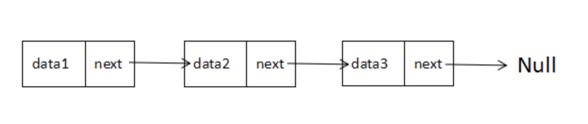

# 链表
## 1、链表的定义
链表是一种物理存储单元上非连续、非顺序的存储结构，数据元素的逻辑顺序是通过链表中的指针链接次序实现的。链表由一系列结点（链表中每一个元素称为结点）组成，结点可以在运行时动态生成。每个结点包括两个部分：一个是存储数据元素的数据域，另一个是存储下一个结点地址的指针域。

### 1.1 节点
链表中每个单元成为节点，节点包含两部分，一部分是存储数据元素的数据域，一部分是存储指向下一个节点的指针域。
### 1.2 有头链表和无头链表
无头链表是指第一个节点既有数据域，又有指针域，第一个节点既是首节点又是头节点。
有头链表是指第一个节点只有指针域，而没有数据域。
常用的无头链表。

## 2、实现链表
### 2.1 定义链表类
```
function LinkList(){

  var length = 0;        // 长度
  var head = null;       // 头节点
  var tail = null;       // 尾节点

  // 定义节点
  var Node = function(data){
      this.data = data;
      this.next = null;
  }
}
```
### 2.2 链表方法扩展
* append，添加一个新的元素
* insert，在指定位置插入一个元素
* remove，删除指定位置的节点
* remove_head，删除首节点
* remove_tail，删除尾节点
* indexOf，返回指定元素的索引
* get，返回指定索引位置的元素
* head，返回首节点
* tail，返回尾节点
* length，返回链表长度
* isEmpty，判断链表是否为空
* clear，清空链表
* print，打印整个链表
  
```
function LinkList(){

  var length = 0;        // 长度
  var head = null;       // 头节点
  var tail = null;       // 尾节点

  // 定义节点
  var Node = function(data){
      this.data = data;
      this.next = null;
  }

  // 添加一个新元素
  this.append = function(data){
      // 创建新节点
      var node = new Node(data);
      // 如果是空链表
      if(head==null){
          head = node;
          tail = head;
      }else{
          tail.next = node;       // 尾节点指向新创建的节点
          tail = node;            // tail指向链表的最后一个节点
      }
      length += 1;                // 长度加1
      return true;
  };

  // 返回链表大小
  this.length = function(){
      return length;
  };

  // 获得指定位置的节点
  var get_node = function(index){
      if(index < 0 || index >= length){
          return null;
      }
      var curr_node = head;
      var node_index = index;
      while(node_index-- > 0){
          curr_node = curr_node.next;
      }
      return curr_node;
  };

  // 在指定位置插入新的元素
  this.insert = function(index, data){
      // index == length,说明是在尾节点的后面新增,直接调用append方法即可
      if(index == length){
          return this.append(data);
      }else if(index > length || index < 0){
          // index范围错误
          return false;
      }else{
          var new_node = new Node(data);
          if(index == 0){
              // 如果在头节点前面插入,新的节点就变成了头节点
              new_node.next= head;
              head = new_node;
          }else{
              // 要插入的位置是index,找到索引为index-1的节点,然后进行连接
              var pre_node = get_node(index-1);
              new_node.next = pre_node.next;
              pre_node.next = new_node;
          }
          length += 1;
          return true;
      }
  };

  // 删除指定位置的节点
  this.remove = function(index){
      // 参数不合法
      if(index < 0 || index >= length){
          return null;
      }else{
          var del_node = null;
          // 删除的是头节点
          if(index == 0){
              // head指向下一个节点
              del_node = head;
              head = head.next;
              // 如果head == null,说明之前链表只有一个节点
              if(!head){
                  tail = null;
              }
          }else{
              // 找到索引为index-1的节点
              var pre_node = get_node(index-1);
              del_node = pre_node.next;
              pre_node.next = pre_node.next.next;
              // 如果删除的是尾节点
              if(del_node.next==null){
                  tail = pre_node;
              }
          }

          length -= 1;
          del_node.next = null;
          return del_node.data;
      }
  };

  // 删除尾节点
  this.remove_tail = function(){
      return this.remove(length-1);
  };

  // 删除头节点
  this.remove_head = function(){
      return this.remove(0);
  };

  // 返回指定位置节点
  this.get = function(index){
      var node = get_node(index);
      if(node){
          return node;
      }
      return null;
  };


  // 返回链表头节点
  this.head = function(){
      return this.get(0);
  }

  // 返回链表尾节点
  this.tail = function(){
      return this.get(length-1);
  }

  // 返回指定元素的索引,如果没有,返回-1
  // 有多个相同元素,返回第一个
  this.indexOf = function(data){
      var index = -1;
      var curr_node = head;
      while(curr_node){
          index += 1
          if(curr_node.data == data){
              return index;
          }else{
              curr_node = curr_node.next;
          }
      }
      return -1;
  };

  // 输出链表
  this.print = function(){
      var curr_node = head;
      var str_link = ""
      while(curr_node){

          str_link += curr_node.data.toString() + " ->";
          curr_node = curr_node.next;
      }
      str_link += "null";
      console.log(str_link);
      console.log("长度为"+ length.toString());
  };

  // isEmpty
  this.isEmpty = function(){
      return length == 0;
  };

  // 清空链表
  this.clear = function(){
      head = null;
      tail = null;
      length = 0;
  };
}
```
## 3、链表相关算法
### 3.1 链表反转
#### 3.1.1 迭代
既然是迭代，就是按照节点顺序一个个实现反转，考虑某一个节点curNode，它的前一个节点perNode，后一个节点是nextNode，要实现curNode的反转，只需要：
```
curNode.next = perNode;
```
根据链表特点，由curNode无法直接获取perNode，所以定义两个游标卡尺，一个用来记录curNode，一个用来记录perNode。在遍历的过程中每个节点完成反转之后，两个游标卡尺随着向后滑动。

考虑首节点headNode，它没有上一个节点，所以它的perNode=null。

代码：
```
// 对LinkList添加reverse_iter实例方法
function LinkList(){
  var length = 0;        // 长度
  var head = null;       // 头节点
  var tail = null;       // 尾节点
  ...

  this.reverse_iter = function() {
    let perNode = null;
    let curNode = head;

    // 手动维护尾结点 第一个节点变成尾结点
    tail = curNode;

    while(curNode) {
      // 手动维护首节点 遍历到最后一个节点 最后一个节点现在变成首节点
      if(curNode.next === null) {
        head = curNode;
      }

      // 开始反转
      let nextNode = curNode.next;  // 后一个节点
      curNode.next = perNode;       // 对当前节点进行翻转
      perNode = curNode;            // perNode游标向后滑动
      curNode = nextNode;           // curNode游标向后滑动      
    }
  }
}

// 测试
const list = new LinkList();
list.append(1);
list.append(2);
list.append(3);
list.reverse_iter();
list.print(); // 输出： 3 ->2 ->1 ->null
```

### 3.1.2 递归
> 递归思想:
> 程序调用自身的编程技巧称为递归（套娃）。自己不会做的事先甩锅让后面的人去做，等别人做完了根据别人的劳动成果自己再去做。
> 以猴子捞月为例，第一只猴子想要月亮，它自己不会就让它下面的猴子去捞，第二只也不会继续让下面的猴子去做，一直甩锅到最后一只猴子，最后一只猴子从水里把月亮捞出来，并把月亮交给倒数第二只猴子完成了它的工作，这时倒数第二只猴子再把月亮交给倒数第三只，这样依次把月亮交到最上面的第一只猴子哪里，整个捞月的工作就完成了。
> 所以递归需要考虑的三个要素：
> * 函数的功能：每只猴子的任务是什么？每只猴子的任务就是捞月，具体点就是想要拿到月亮并传给上一只猴子。
> * 结束条件：什么时候找不到下一只猴子了，就不能再甩锅了，必须自己从水里拿到月亮完成任务。
> * 别人做完了我该怎么做：拿到别人的工作成果，我自己应该怎么做

#### 实现方式一
假设对含有三个节点的链表（①->②->③->null）进行反转。
* 第一步：从第一个节点开始，对于节点①，它自己不会反转，就先让②节点去反转，并希望②节点最后给到自己的是一个反转完成的链接结果result（③->②->null）的尾结点②，然后把自己添加到result的尾结点②的后面就完成了自己的任务。
* 第二步：然而②节点反转的时候跟①节点也是一样的想法，继续甩锅给③节点，
* 第三步：③节点是最后的节点，无法继续甩锅了，只能自己亲自动手开始对自己反转，反转的结果就是得到一个（③->null）这样的链表，而自己就是尾结点，所以把自己返回给第二步，让②节点拿自己的成果去实现反转。

针对上面的思路，可以明确递归函数的功能就是完成当前节点的反转，并把反转之后的尾结点给到上一个节点。结束条件就是最后一个节点的next指向null

```
// 对LinkList添加reverse_iter实例方法
function LinkList(){
  var length = 0;        // 长度
  var head = null;       // 头节点
  var tail = null;       // 尾节点
  ...

  this.reverse_recursion = function(node){
    if(node.next == null) {
      // 当前的尾节点  最终尾节点变成首节点
      head = node;
      return node;
    }
    // 获取反转之后的尾结点
    let last = this.reverse_recursion(node.next);
    // 将当前节点变成未尾结点 并且尾结点的next是null
    last.next = node;
    node.next = null;

    // 手动维护实例尾结点
    tail = node;
    
    // 返回尾结点
    return node;
  }
}

// 测试
const list = new LinkList();
list.append(1);
list.append(2);
list.append(3);
list.reverse_recursion(list.head());
list.print();   // 输出： 3 ->2 ->1 ->null
```

通过调试把上面的代码走一遍，代码执行流程：


